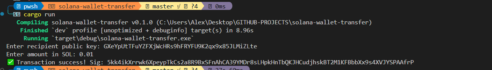

#  Solana Wallet Transfer CLI (Rust)

A lightweight CLI tool written in **Rust** to transfer native **SOL** between wallets on the **Solana blockchain** — interactively, securely, and fast.

No Anchor. No frontend. Just **raw power + CLI flow**. Ideal for automation, testing, or wallet scripting.



---

##  Features

-  Secure keypair loading from `.env`
-  Dynamic input of recipient and amount from CLI
-  Built using `solana-sdk` and `solana-client`
-  Uses **Helius RPC** for max performance
-  Uses `confirmed` commitment level for balanced speed and safety
-  Clean structure for reusability in other Solana tools

---

##  Installation & Setup

### 1. Clone the repo

```bash
git clone https://github.com/yourusername/solana-wallet-transfer.git
cd solana-wallet-transfer
```

### 2. Build the project

```bash
cargo build --release
```

### 3. Create a `.env` file in the root

```env
PRIVATE_KEY=your_base58_private_key_here
```

> ⚠️ Use base58-encoded private key, not JSON format.  
> You can export from Phantom/Solflare.

---

## 🚀 Usage

```bash
cargo run
```

You'll be prompted to enter:
- Recipient public key
- Amount in SOL

Example output:

```
Enter recipient public key: 7ZfYwZfNtC6s5u9ZK...
Enter amount in SOL: 0.1
✅ Transaction success! Sig: 5syH9oWkz...
```

---

##  Screenshot


---

##  Commitment Levels Explained

| Level        | Speed 🚀 | Safety 🛡️ | Use Case                          |
|--------------|----------|-----------|-----------------------------------|
| `processed`  | Fastest  | Least safe | UI feedback / testing             |
| `confirmed`  | Medium   | Safer      | Regular payments (used here)      |
| `finalized`  | Slowest  | Safest     | DAO votes, high-value txs         |

We use `confirmed` to strike the best balance between speed and trust.

---

##  Tech Stack

- [Rust](https://www.rust-lang.org/)
- [Solana SDK](https://docs.rs/solana-sdk)
- [Helius RPC](https://helius.dev/)
- [dotenv](https://crates.io/crates/dotenv)

---

##  Support & Community

Need help or building something on Solana?

-  **Support Contact**:  
  Message me anytime → [@virualsolana](https://t.me/virualsolana)

---

##  License

MIT License © 2025  
Built for the Solana devs, degens, and legends.

---

> Made with ❤️ by [@virualsolana](https://t.me/virualsolana)  
> The chain never sleeps. Neither do we. ⛓️🔥
